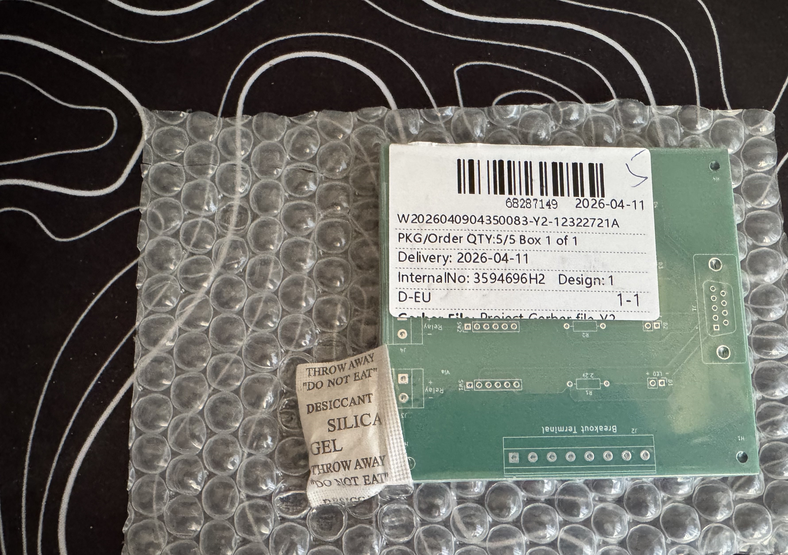
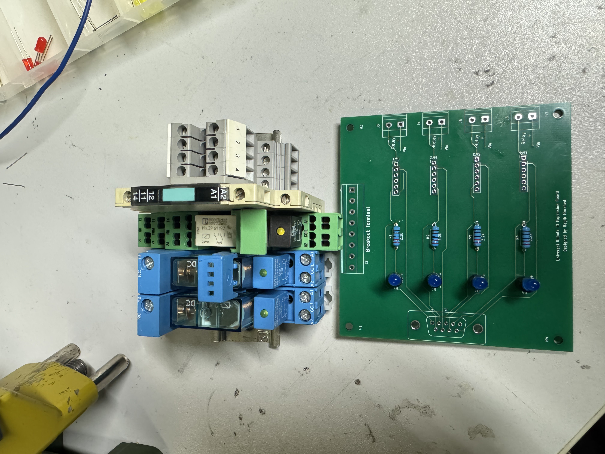

# Universal-Robots-IO-Relay-Expansion-PCB
Designed and developed a custom 4-channel industrial relay interface PCB for expanding 24V digital I/O capabilities of Universal Robots (UR5e, UR30) and enabling control of external AC and DC peripherals.

This system allows safe and modular interfacing between low-voltage robot outputs and higher-power devices such as pneumatic pumps, fans, and auxiliary equipment.

---

## Key Features
- 4-channel relay-based I/O expansion
- Compatible with standard 24V robotic digital I/O systems
- Supports control of both AC (mains) and DC loads
- Electrical isolation between robot and external devices
- Designed for industrial prototyping and demonstration environments
- Uses Status LEDs for monitoring
- Allows both Manual and Automatic Control of the peripherals

---

## Hardware Design
- Designed in KiCAD
- Relay-based switching using industrial components
- Screw terminal interfaces for easy wiring
- Integrated protection and signal routing for safe operation

---

## System Integration
- Connected to Universal Robots digital outputs
- Used for controlling:
  - Pneumatic vacuum pump
  - Cooling fans
  - Vibration motor
  - Dry-Ice machine
  - Other Auxiliary devices in robotic workflows
- Integrated into robotic pick-and-place and palletizing systems

---

## My Contributions
- PCB design and layout (KiCAD)
- Component selection and circuit design
- Soldering and hardware assembly
- Electrical wiring and system integration
- Testing and validation in real robotic workflows

---

## Media

### PCB Render

### Schematic

### Assembled Board

### System Setup

---

## Applications
- Robotic automation systems
- Industrial prototyping setups
- I/O expansion for collaborative robots
- Peripheral device control in robotics workflows

---

## Future Improvements
- Opto-isolation for enhanced protection
- Compact enclosure design
- Modular stacking for higher channel counts
- Integration with PLC systems

---

## Tools & Technologies
- KiCAD
- Industrial relays
- 24V digital I/O systems
- Hardware prototyping and soldering
